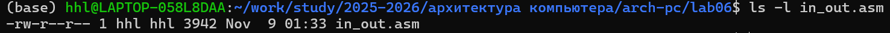
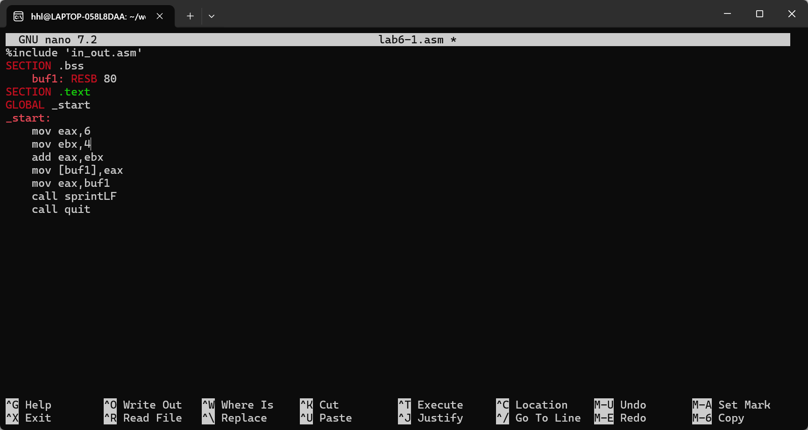
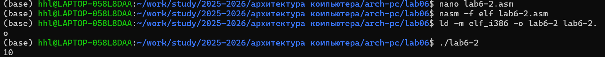
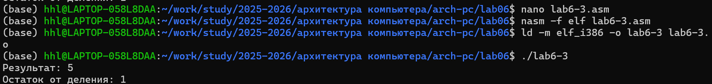
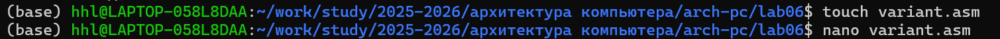

# Отчёт по лабораторной работе
## Архитектура ЭВМ. Лабораторная работа №6: Арифметические операции в NASM

**ФИО:** [Сунь Шэнцзе]
**Номер студенческого билета:** [1132254527]
**Дата:** [17.11.2025]
**Вариант:** [8]

---

## 1. Цель работы
Освоение арифметических инструкций языка ассемблера NASM, понимание разницы между символьными и численными данными, изучение функций преобразования ввода-вывода.

---

## 2. Подготовка рабочей среды

---

## 3. Эксперимент 6.3.1 Символьные и численные данные

### 3.1 Первая программа: сложение символов
**Файл:** lab6-1.asm
**Результат:** j

### 3.2 Изменение на численные операции
**Результат:** нет видимого вывода

### 3.3 Использование функции iprintLF
**Файл:** lab6-2.asm
**Результат:** 106

### 3.4 Численные операции с iprintLF
**Результат:** 10

### 3.5 Разница между iprint и iprintLF
**Результат теста:** iprint не переводит строку, iprintLF переводит строку

---

## 4. Эксперимент 6.3.2 Арифметические операции

### 4.1 Вычисление выражения f(x) = (5 * 2 + 3)/3
**Файл:** lab6-3.asm
**Результат:**
Результат: 4
Остаток от деления: 1

### 4.2 Изменение на (4 * 6 + 2)/5
**Результат:**
Результат: 5
Остаток от деления: 1

---

## 5. Программа вычисления варианта

### 5.1 Программа variant.asm
**Введенный номер:** [1132254527]
**Результат:** Ваш вариант: [8]

### 5.2 Ответы на вопросы
1. **Какие строки отвечают за вывод 'Ваш вариант:'?**  
   mov eax,rem и call sprint

2. **Для чего используются следующие инструкции?**  
   mov ecx, x - установка адреса буфера ввода  
   mov edx, 80 - установка максимальной длины ввода  
   call sread - вызов функции чтения строки

3. **Для чего используется инструкция "call atoi"?**  
   Для преобразования ASCII-строки в целое число

4. **Какие строки отвечают за вычисления варианта?**  
   xor edx,edx, mov ebx,20, div ebx, inc edx

5. **В какой регистр записывается остаток от деления?**  
   В регистр EDX

6. **Для чего используется инструкция "inc edx"?**  
   Для увеличения остатка на 1, так как варианты нумеруются с 1

7. **Какие строки отвечают за вывод результата вычислений?**  
   mov eax,edx и call iprintLF

---

## 6. Самостоятельная работа

### 6.1 Описание задания
**Вариант:** [8]
**Функция:** [f(x) = (11 + x) · 2 - 6]
**Тестовые значения:** x1 = 1, x2 = 9

### 6.2 Результаты тестирования
**Результат для x1:** [результат x1]

**Результат для x2:** [результат x2]

---

## 7. Выводы
В ходе лабораторной работы я освоил арифметические инструкции NASM, понял разницу между символьными и численными данными. Научился использовать функции преобразования atoi/iprint, изучил работу с регистрами в операциях mul/div. Успешно реализовал вычисление сложных выражений в самостоятельной работе, что заложило основу для дальнейшего изучения архитектуры ЭВМ.

---
