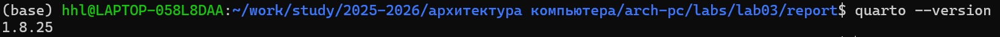
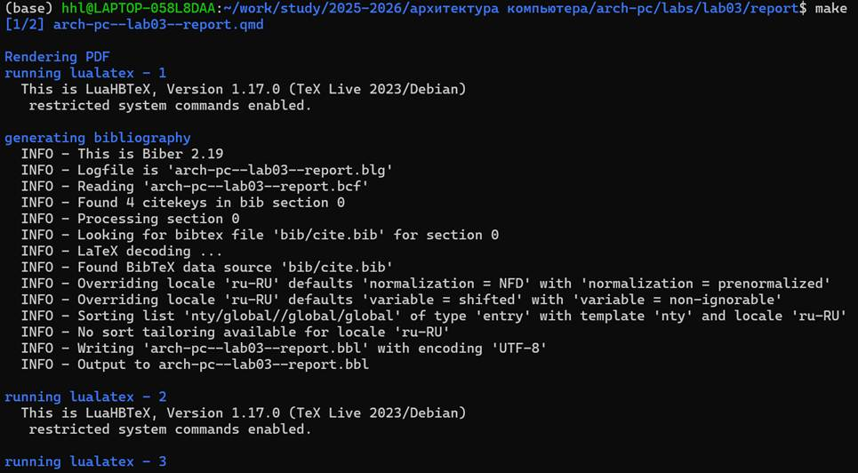
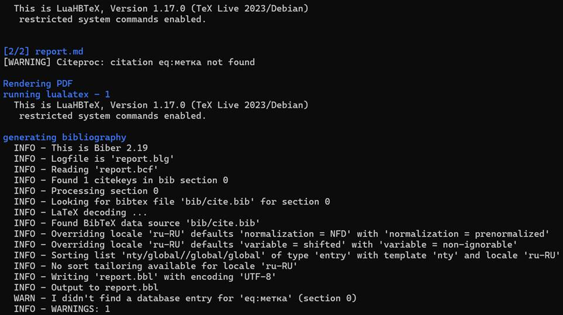
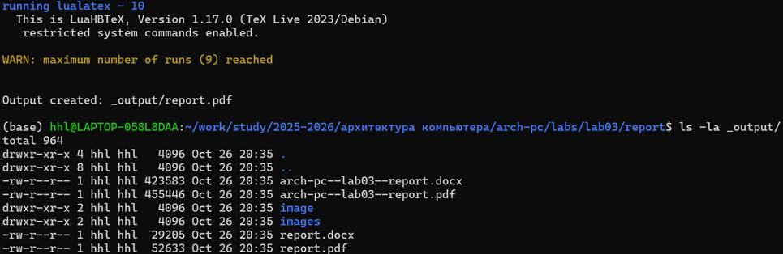

# Лабораторная работа № 3. Язык разметки Markdown

## Цель работы

Освоить процедуру оформления отчетов с помощью легковесного языка разметки Markdown, изучить базовый синтаксис и расширенные функции Markdown, включая заголовки, списки, блоки кода, математические формулы, вставку изображений, а также научиться использовать инструмент Quarto для генерации документов в различных форматах.

## Ход работы

### Задание 1: Настройка окружения и установка программного обеспечения
Успешно установили Quarto v1.8.25, создали полную среду для компиляции документов. Проверили установку программного обеспечения с помощью терминала.



### Задание 2: Тестирование компиляции отчета
Использовали Makefile для компиляции шаблона отчета. Решили проблемы с зависимостями пакетов LaTeX.





### Задание 3: Тестирование компиляции шаблона
Успешно скомпилировали шаблон отчета с использованием Makefile, проверили рабочий процесс Quarto:
```bash
make          # Генерация файлов PDF и DOCX
make clean    # Очистка сгенерированных файлов


## Анализ результатов

Проблема 1: Неясное отображение информации в процессе установки TinyTeX

Решение: Проблема решена путем проверки процессов и переустановки

Проблема 2: Незнакомство с процессом компиляции при первом использовании Quarto

Решение: Освоение процесса компиляции путем изучения документации и многократной практики

## Работайте автономно

1. 1. Выполнен отчет по **лабораторной работе №3** в формате Markdown, включая три формата: PDF, DOCX и MD
2. Все файлы загружены в репозиторий GitHub, обеспечен полный контроль версий

## Выводы

В ходе данной лабораторной работы успешно достигнуты все поставленные цели:
Уверенное освоение базового синтаксиса и расширенных функций языка разметки Markdown
Создание полной среды для написания и компиляции документов
Обучение использованию Quarto для генерации документов в нескольких форматах
Освоение стандартных требований к формату академических отчетов
Выполнение базового процесса контроля версий и совместной разработки
Эксперимент подтвердил, что Markdown является эффективным и лаконичным инструментом для написания документов, особенно подходящим для технической документации и академических отчетов.

## Ответы на вопросы для самопроверки

1. Markdown — это облегченный язык разметки, использующий синтаксис в формате простого текста, который может быть преобразован в структурированные HTML-документы. Он прост для чтения и записи, подходит для написания документации, отчетов и веб-контента.
2. Полужирное: с помощью двойных звездочек **полужирный** или двойного подчеркивания __полужирный__
Курсивное: с помощью одинарных звездочек *курсив* или одинарного подчеркивания _курсив_
Полужирное и курсивное: с помощью тройных звездочек ***полужирный курсив***
3. Упорядоченный список: с использованием цифр 1. Элемент
Неупорядоченный список: с использованием звездочек * Элемент, минусов - Элемент или плюсов + Элемент
Вложенные списки: создаются с помощью отступов (2 или 4 пробела) для дочерних элементов
4. Вставка изображения
Ссылка на изображение
5. Встроенная формула: $формула$
Выделенная формула: $$ формула $$ {#eq:метка}
Ссылка на формулу: ([-@eq:метка])


