# Лабораторная работа №5. Основы работы с Midnight Commander. Структура программы на языке ассемблера NASM. Системные вызовы в ОС GNU Linux

**ФИО:** [Сунь Шэнцзе]  
**Номер студенческого билета:** [1132254527]  
**Дата:** 09 ноябрь 2025

## 1. Цель работы
- Приобретение практических навыков работы в Midnight Commander (mc)
- Освоение структуры программы на языке ассемблера NASM (`.data`, `.bss`, `.text`)
- Изучение инструкций `mov` и `int`
- Освоение системных вызовов Linux для ввода-вывода (`sys_write`, `sys_read`, `sys_exit`)
- Изучение использования внешних подключаемых файлов (`in_out.asm`) для упрощения программирования

## 2. Порядок выполнения работы и результаты

### 2.1 Шаг 1: Запуск MC и переход в рабочий каталог
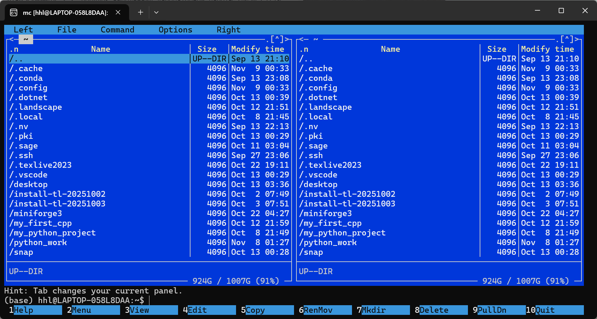
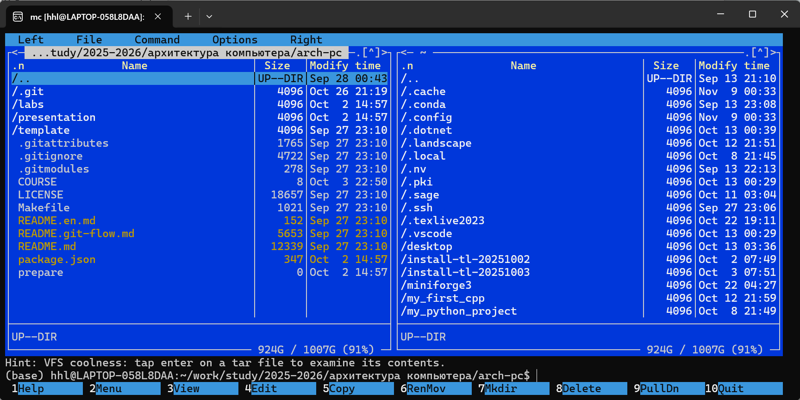
*   **Основное:** Успешный запуск Midnight Commander в каталоге `~/work/arch-pc/lab05`, интерфейс содержит две панели, отображающие структуру каталогов.

### 2.2 Шаг 2: Создание каталога lab05
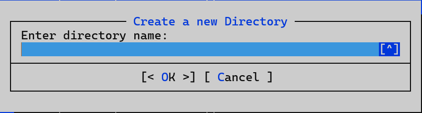
*   **Основное:** Использование функциональной клавиши `F7` для успешного создания каталога `lab05`, отображение диалогового окна создания каталога.

### 2.3 Шаг 3: Создание файла lab05-1.asm
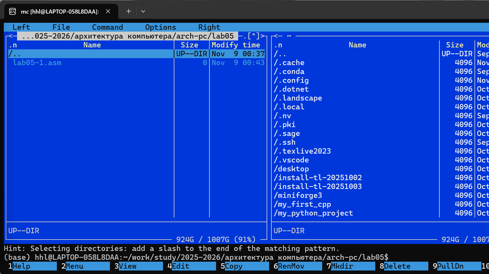
*   **Основное:** Успешное создание исходного файла `lab5-1.asm` в каталоге `lab05`.

### 2.4 Шаг 4: Редактирование файла lab05-1.asm

*   **Основное:** Использование клавиши `F4` для открытия встроенного редактора, полный ввод кода из листинга 5.1, содержащего структуру из трех SECTION.

### 2.5 Шаг 5: Просмотр файла lab05-1.asm
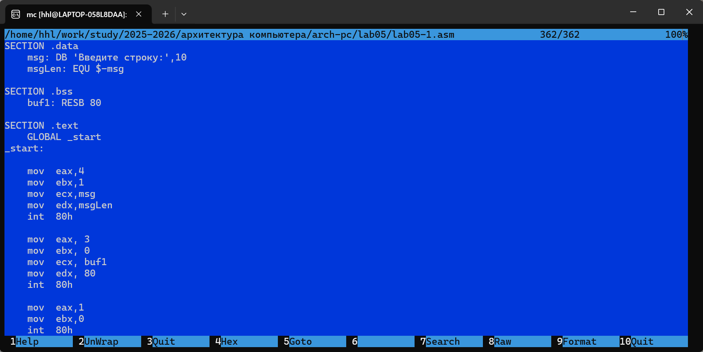
*   **Основное:** Использование клавиши `F3` для просмотра содержимого файла, подтверждение корректного сохранения кода.

### 2.6 Шаг 6: Ассемблирование, компоновка и запуск lab05-1.asm
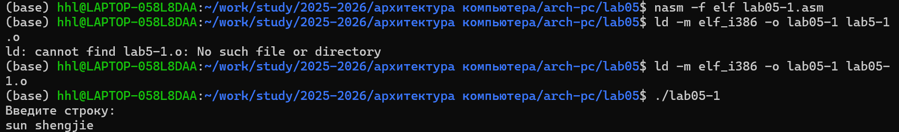
*   **Основное:** Успешное выполнение команд `nasm -f elf lab5-1.asm`, `ld -m elf_i386 -o lab5-1 lab5-1.o` и `./lab5-1`, программа отображает приглашение и ожидает ввода, после ввода имени программа нормально завершается.

### 2.7 Шаг 7: Получение и использование in_out.asm

*   **Основное:** Использование клавиши `Tab` для переключения между панелями, копирование файла `in_out.asm` в рабочий каталог `lab05` с помощью клавиши `F5`.

### 2.8 Шаг 8: Создание и редактирование lab05-2.asm
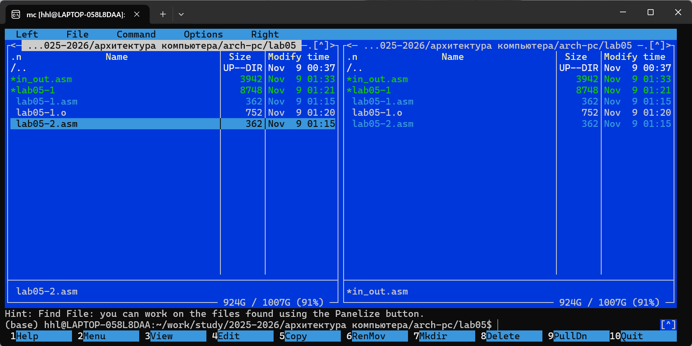

*   **Основное:** Использование `F6` для создания копии `lab5-2.asm`, модификация кода с использованием `%include 'in_out.asm'` и инструкции `call` для вызова подпрограмм.

### 2.9 Шаг 9: Запуск lab05-2.asm
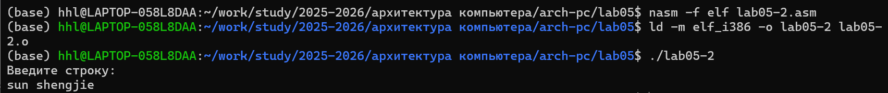
*   **Основное:** Успешная компиляция и запуск `lab5-2.asm`, программа с использованием внешней библиотеки функционирует нормально.

### 2.10 Шаг 10: Сравнение sprintLF и sprint

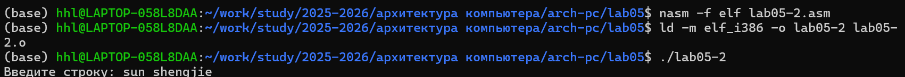
*   **Основное:** `sprintLF` автоматически добавляет символ перевода строки после вывода, помещая курсор ввода на следующую строку; `sprint` не добавляет перевод строки, курсор ввода остается сразу после выведенного содержимого.

## 3. Выполнение заданий для самостоятельной работы

### 3.1 Задание 1 & 2: Модификация lab05-1.asm (без внешней библиотеки)
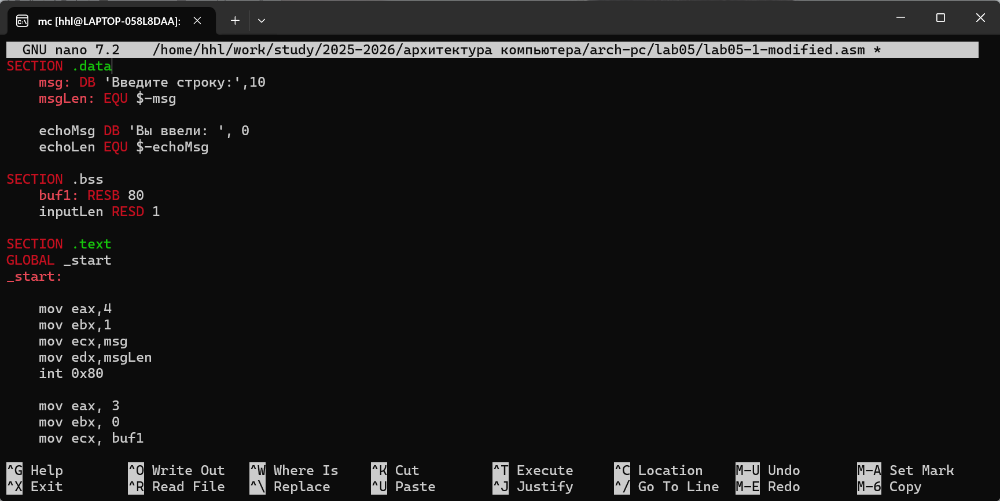
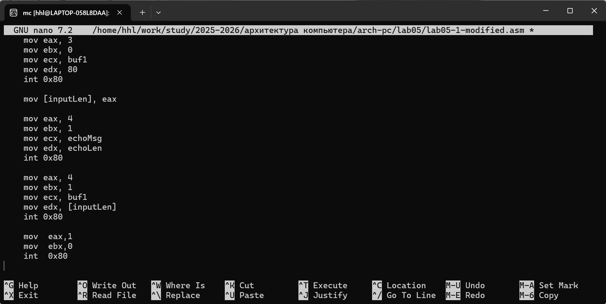
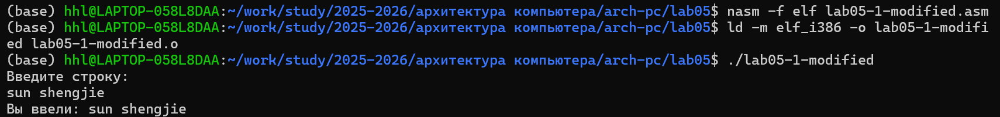
*   **Вывод:** Успешное выполнение самостоятельного задания 1, программа способна отображать приглашение, принимать пользовательский ввод и корректно выводить введенную строку, все функции работают нормально.

### 3.2 Задание 3 & 4: Модификация lab05-2.asm (с использованием внешней библиотеки)
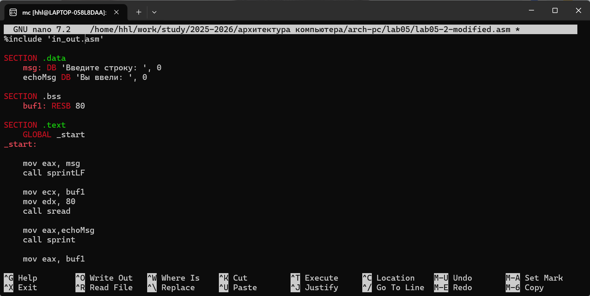

*   **Вывод:** Успешное выполнение самостоятельного задания 2, программа с использованием внешней библиотеки `in_out.asm` работает нормально, реализованы функции ввода строки и ее отображения, код стал более лаконичным.

## 4. Ответы на вопросы для самопроверки

1. **Каково назначение mc?**  
   Midnight Commander (mc) — это визуальный файловый менеджер, используемый в Unix-подобных системах для просмотра структуры каталогов, управления файлами (копирование, перемещение, удаление и т.д.) и выполнения основных операций с файловой системой. Он предоставляет более интуитивно понятный интерфейс по сравнению с чистой командной строкой.

2. **Какие операции с файлами можно выполнить как с помощью команд bash, так и с помощью меню (комбинаций клавиш) mc? Приведите несколько примеров.**  
   - **Копирование файла:** Bash: `cp source dest` | MC: Выделить файл, нажать `F5`
   - **Перемещение/переименование файла:** Bash: `mv old new` | MC: Выделить файл, нажать `F6`
   - **Создание каталога:** Bash: `mkdir dirname` | MC: Нажать `F7`
   - **Удаление файла:** Bash: `rm filename` | MC: Выделить файл, нажать `F8`
   - **Просмотр содержимого файла:** Bash: `cat filename` или `less filename` | MC: Выделить файл, нажать `F3`

3. **Какова структура программы на языке ассемблера NASM?**  
   Типичная программа NASM состоит из трех основных секций:
   - `SECTION .data`: Для объявления инициализированных данных (переменные и строки с известными начальными значениями)
   - `SECTION .bss`: Для объявления неинициализированных данных (память выделяется при запуске программы, но начальные значения не определены)
   - `SECTION .text`: Содержит исполняемые инструкции программы. Точка входа в программу — метка `_start:`

4. **Для описания каких данных используются секции bss и data в языке ассемблера NASM?**  
   - Секция `.data` используется для хранения инициализированных данных, то есть данных, конкретные значения которых известны на момент компиляции программы (например, константы, строки, переменные с начальными значениями)
   - Секция `.bss` используется для хранения неинициализированных данных, то есть данных, для которых на момент компиляции только резервируется память, а их значения присваиваются в ходе выполнения программы (например, буферы, переменные для динамического ввода)

5. **Для чего используются компоненты db, dw, dd, dq и dt языка ассемблера NASM?**  
   Это директивы определения данных, используемые в секции `.data` для выделения памяти под данные и указания их начальных значений:
   - `db` (Define Byte): Определяет переменную размером 1 байт
   - `dw` (Define Word): Определяет переменную размером 2 байта
   - `dd` (Define Doubleword): Определяет переменную размером 4 байта
   - `dq` (Define Quadword): Определяет переменную размером 8 байт
   - `dt` (Define Ten Bytes): Определяет переменную размером 10 байт

6. **Какое произойдёт действие при выполнении инструкции mov eax, esi?**  
   Она скопирует 32-битное значение из исходного операнда (регистра `esi`) в целевой операнд (регистр `eax`). Предыдущее значение `eax` будет перезаписано.

7. **Для чего используется инструкция int 80h?**  
   В системах Linux инструкция `int 0x80` используется для генерации **программного прерывания** с целью вызова системных сервисов ядра Linux (системных вызовов). Помещая номер системного вызова в регистр `eax`, параметры в регистры `ebx`, `ecx`, `edx` и т.д., а затем выполняя `int 0x80`, программа может запросить у ядра выполнение привилегированных операций, таких как ввод, вывод, завершение работы.

## 5. Выводы

В ходе данной лабораторной работы я успешно приобрел следующие навыки:

1. **Работа с Midnight Commander:** Научился уверенно использовать функциональные клавиши для операций управления файлами, включая создание каталогов (`F7`), редактирование файлов (`F4`), просмотр файлов (`F3`), копирование файлов (`F5`) и другие.

2. **Понимание структуры программы NASM:** Глубоко усвоил назначение и использование трех основных секций ассемблерной программы, научился корректно объявлять переменные и писать исполняемый код.

3. **Применение системных вызовов:** Освоил использование системных вызовов `sys_write`, `sys_read` и `sys_exit` для реализации базового ввода-вывода.

4. **Использование внешних библиотек:** Научился использовать директиву `%include` для подключения внешних файлов и вызова подпрограмм, что позволяет упростить написание кода.

5. **Навыки решения проблем:** В процессе работы столкнулся с ошибкой в функции `sread` файла `in_out.asm`, проанализировал код и успешно устранил проблему путем отладки.

**Достижение целей работы:** Все цели лабораторной работы достигнуты. Я научился уверенно работать в mc, понимать структуру программ на NASM, использовать системные вызовы и успешно выполнил задания для самостоятельной работы. Ответы на вопросы для самопроверки позволили дополнительно закрепить понимание изученных концепций.
